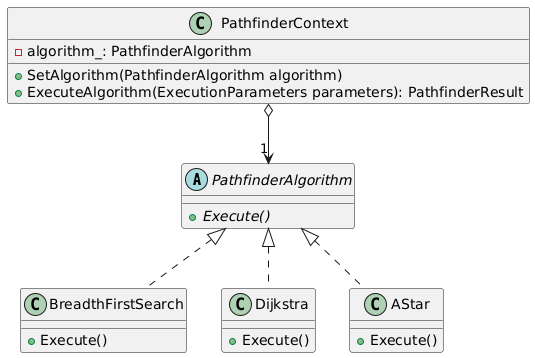

# PathFinder Algorithms Visualization
C++ project to visualize different pathfinder algorithms on a 2D grid. 
For the GUI it uses [imgui](https://github.com/ocornut/imgui).

## Build and Run
### External Requirements for imgui
- **Platform backend**: SDL2: `sdl2-config --version // 2.30.0`
- **Renderer backend**: OpenGL3: `glxinfo | grep "OpenGL version" // OpenGL version string: 4.6 (Compatibility Profile) Mesa 24.2.8-1ubuntu1~24.04.1`

```
mkdir build
cd ./build
cmake ..
make

./test/pathfinder_test // run the tests

./src/main/pathfinder_vis // run the application 
```

## Repository Structure
- `./src/gui/`: code for the frontend, implemented using `imgui` (located in `./lib/imgui/`). 
- `./src/pathfinder/`: code for the pathfinder algorithms.
- `./src/main/`: entry point of the application (`main.cpp`).
- `./test/`: unit tests for the pathfinder algorithms.

## Code Structure
The *Strategy Design Pattern* is used for the pathfinder algorithms. See the following class diagram:



The API can be used as follows:
```cpp
#include "pathfinder/pathfinder_algorithms.h"
#include "pathfinder/execution_parameters.h"
#include "pathfinder/pathfinder_result.h"
#include "pathfinder/position.h"
#include "pathfinder/pathfinder_context.h"

PathfinderContext context;

ExecutionParameters parameters{
    5, // number of columns in grid
    5, // number of rows in grid
    Position(0, 0), // start position
    Position(3, 3), // finish position
    {Position(1, 0), Position(2, 0)} // vector of obstacle nodes
};

context.SetAlgorithm(std::make_unique<AStar>());

PathfinderResult result = context.ExecuteAlgorithm(parameters);
```

The `PathfinderResult` contains the following member variables:
1. `bool found_path`
2. `std::vector<SetOfPositions> explored_steps` /* At each step, all explored positions. */
3. `VectorOfPositions path` 